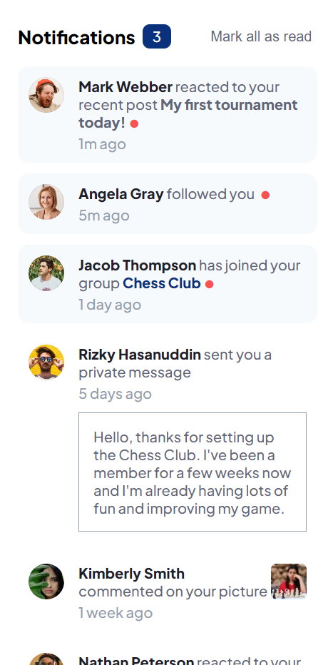
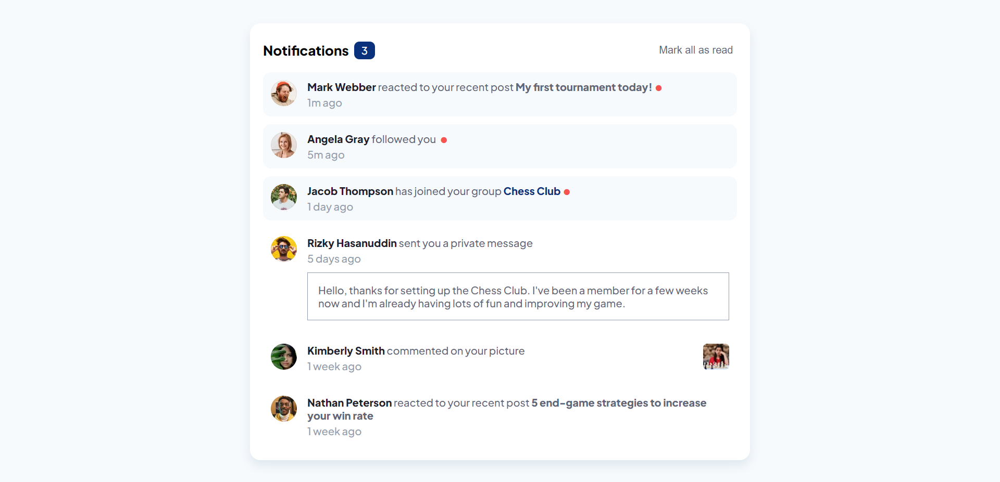

# Frontend Mentor - Notifications page solution

This is a solution to the [Notifications page challenge on Frontend Mentor](https://www.frontendmentor.io/challenges/notifications-page-DqK5QAmKbC). Frontend Mentor challenges help you improve your coding skills by building realistic projects. 

## Table of contents

- [Overview](#overview)
  - [The challenge](#the-challenge)
  - [Screenshot](#screenshot)
  - [Links](#links)
- [My process](#my-process)
  - [Built with](#built-with)
  - [What I learned](#what-i-learned)
  - [Continued development](#continued-development)
  - [Useful resources](#useful-resources)
- [Author](#author)

## Overview

This is my attempt at the Notifications Page Challenge. This web app takes user, picture, and post information to generate a column with notification entries each with specific content based on the type of action the user took.

### The challenge

Users should be able to:

- Distinguish between "unread" and "read" notifications
- Select "Mark all as read" to toggle the visual state of the unread notifications and set the number of unread messages to zero
- View the optimal layout for the interface depending on their device's screen size
- See hover and focus states for all interactive elements on the page

### Screenshot




### Links

- Live Site URL: [Github Pages Link](https://bmagana5.github.io/notifications-page)

## My process

I started out by creating the HTML layout with all of the necessary buttons, text, etc. Then, based on the provided information in the design images, I created several suitable JSON files pertaining to user, notification, post, and picture data. Since I plan on hosting this web app through Github Pages, I decided to host these JSON files locally through the public directory of the web app instead of using a database like MySQL or MongoDB, so the approach I took to import the JSON data is far different than with using the JavaScript fetch API or the JS library Axios. With JS, I implemented formatting the appropriate data and then with React, I embedded the data where appropriate. Once I was done getting all of the logical programming aspects of the app, I began styling with CSS and Sass with a mobile-first approach. I styled everything to work with devices with a viewport width of at least 480px first, and then for tablets and desktops.

### Built with

- Semantic HTML5 markup
- CSS custom properties
- Flexbox
- Mobile-first workflow
- [React](https://reactjs.org/) - JS library

### What I learned

I was familiar with making GET, POST, PUT, and DELETE requests to a server's resource, but I wasn't sure on how to retrieve images and JSON files locally. I did a bit of digging online and eventually found that one can access the local public root directory with: 
```js
process.env.PUBLIC_URL
```

Everything fell into place once I discovered this.

### Useful resources

- [Gerard's Solution on this Stackoverflow Post](https://stackoverflow.com/questions/47196800/reactjs-and-images-in-public-folder/#answer-54844591) - This was what I needed to access the /public directory in my project and access any images I needed.

## Author

Brian Magana
- Frontend Mentor - [@bmagana5](https://www.frontendmentor.io/profile/bmagana5)
